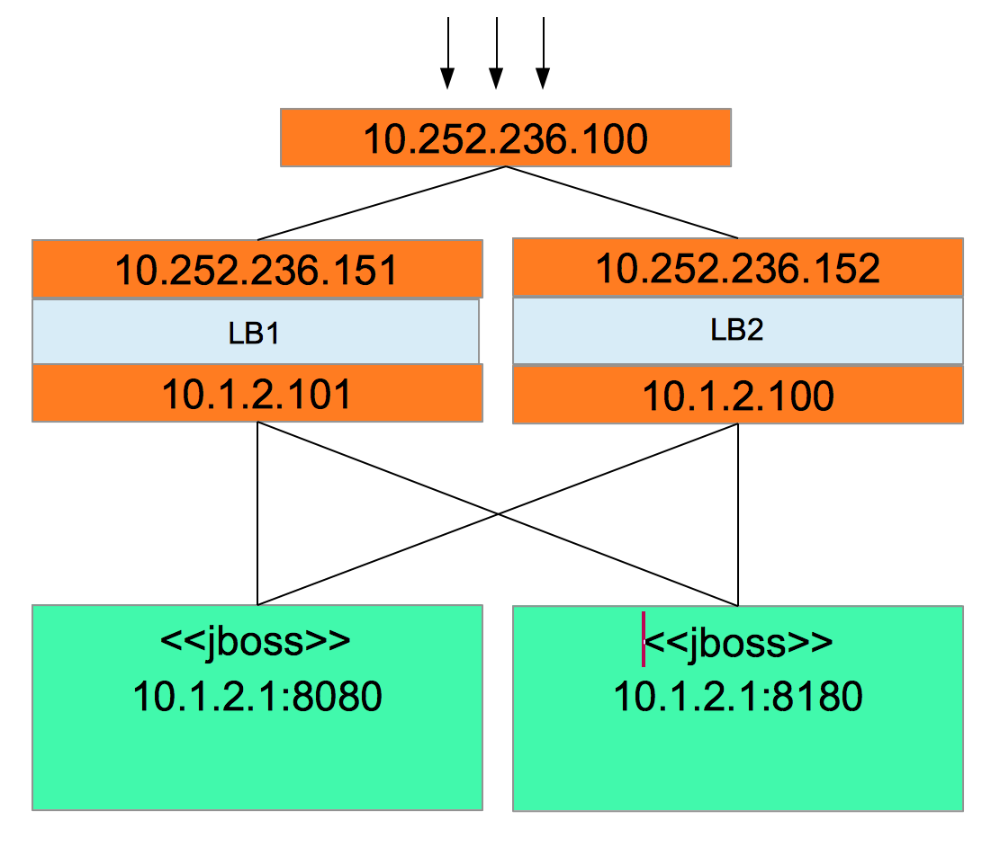

# This is a simple setup for a Highly Available HAProxy

## The setup needs 2 VMs. Each VM has 2-network interfaces. One interface is the public interface and the other is a private interface.

For this demo, we have the following

- public network interface : 10.252.236.x
- private network interface: 10.1.2.x
- public virtual ip:         10.252.236.100

## Deployment Diagram



Clients will access the service at the public virtual IP. The HAProxy will proxy these requests to one of the backend servers.

The keepalived daemon assigns the public virtual IP to the master. On the event that the master will be unavailable, the keepalived will assign the public virtual IP to the backup.
 
## Our backend servers are running JBoss EAP running on the following endpoints:

   - 10.1.2.1:8080
   - 10.1.2.1:8180

## To install this setup, run the following:

```
ansible-playbook -i hosts main.yaml
```
